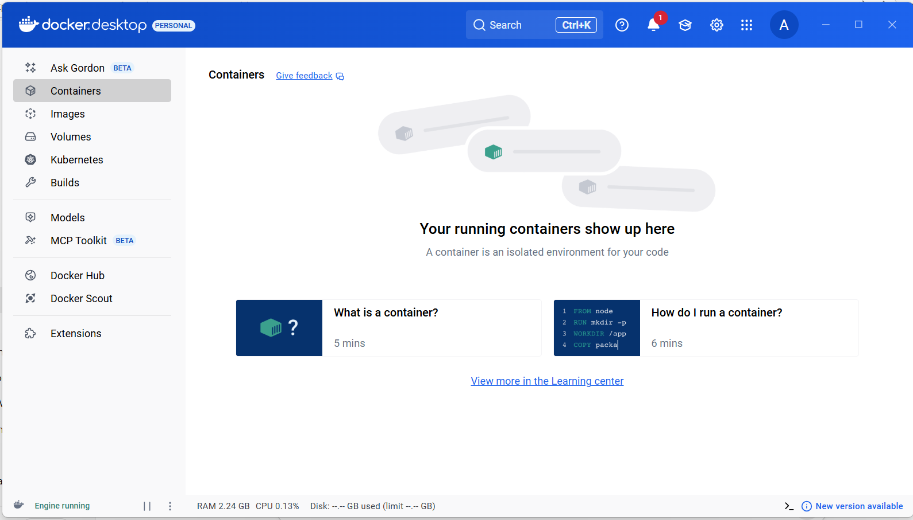
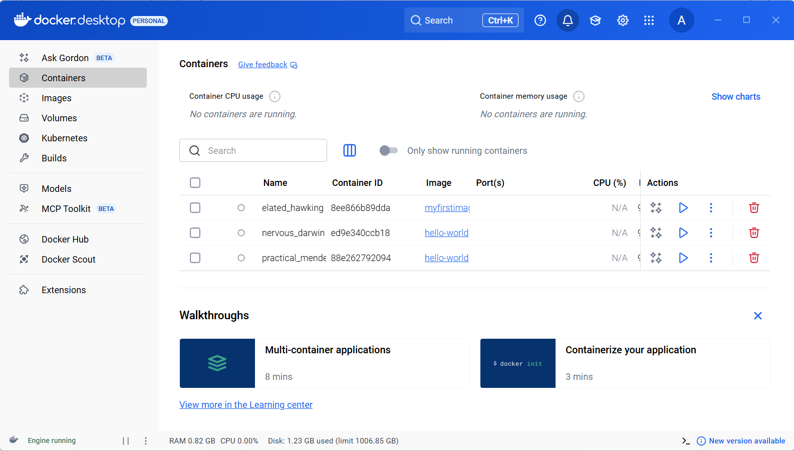
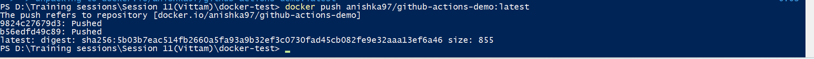
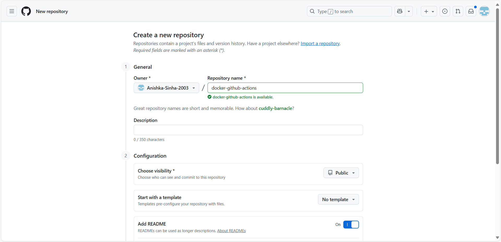
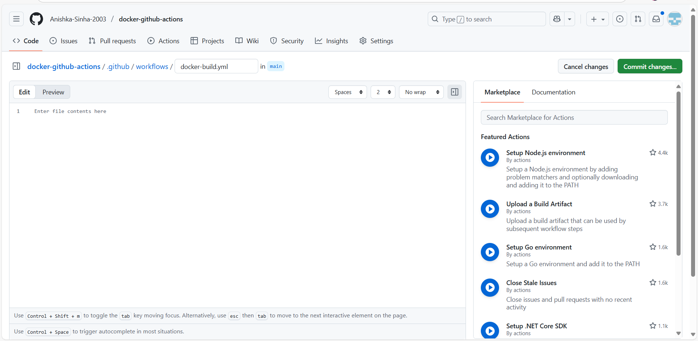
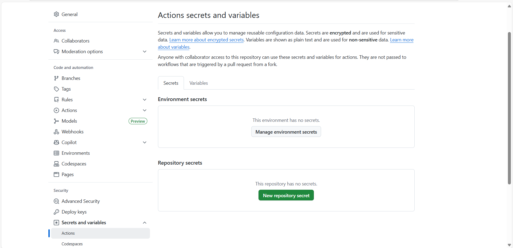
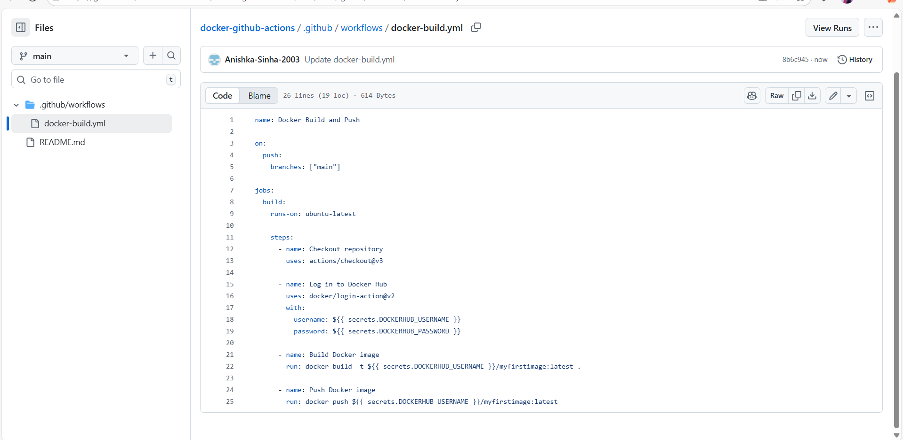
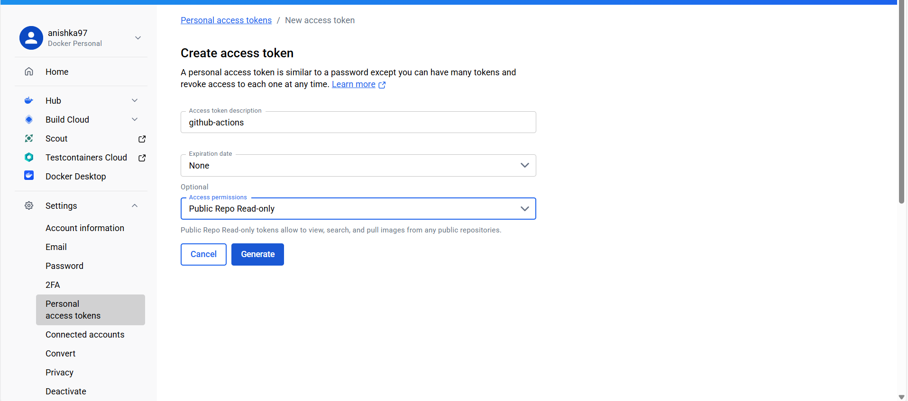

**Installed Docker Desktop in the local machine :-**

 
 

**Build Docker images :-**

 
 

**Pushed the image to Docker Hub :-**

 
 

**Created a new GitHub Repository :-**

 
 

**Created the GitHub Actions workflow folder :-**

 
 

**Adding secrets for Docker Hub :-**

 
 

**Created the YAML file :-**

 
 

**Creating the access token :-**

 
 

