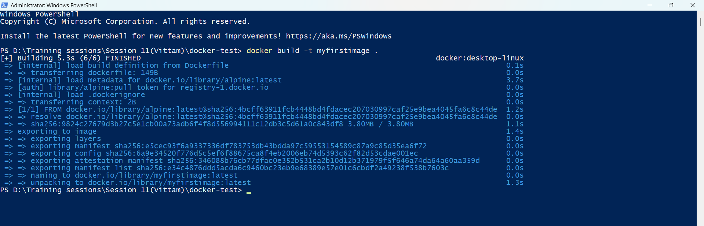
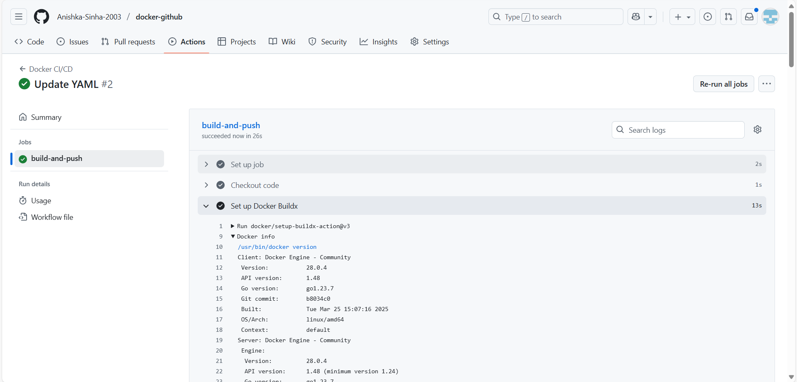
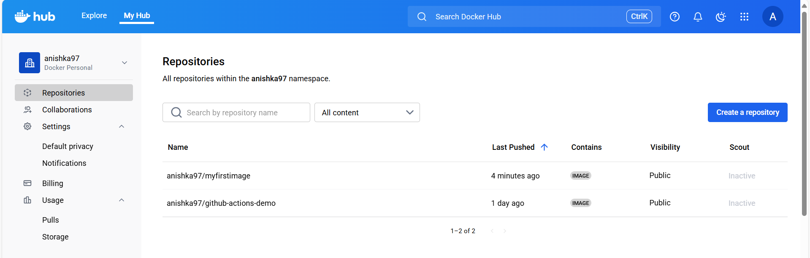
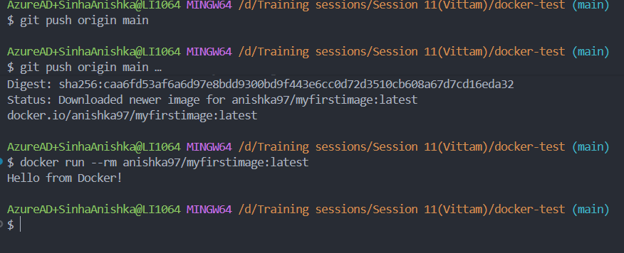

# update
## Containerizing an application and automating the image build & push with GitHub Actions

**Installed Docker Desktop in the local machine :-**

 
 

**Build Docker images :-**

 
 

**Pushed the image to Docker Hub :-**

 
 

**Created a new GitHub Repository :-**

 
 

**Created the GitHub Actions workflow folder :-**

 
 

**Adding secrets for Docker Hub :-**

 
 

**Created the YAML file :-**

 
 

**Creating the access token :-**

 
 

**Build pipeline run successfully :-**

 
 

 
 

**Image got build and pushed in the docker hub as well :-**

 
 

**Pulling the docker image build from the docker hub :-**

**Updated**
